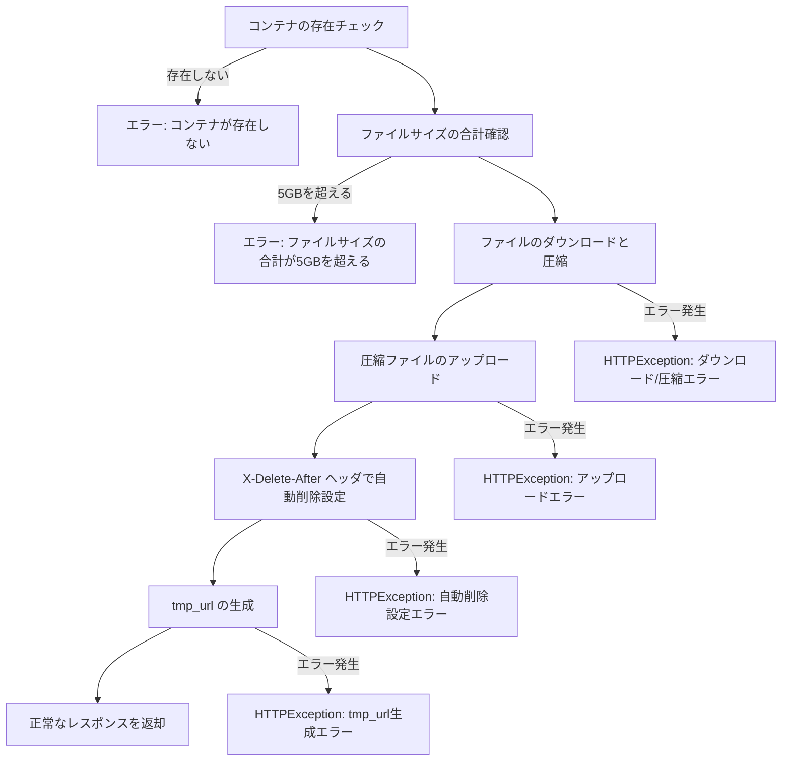

# FastAPI-ObjStorage-Compressor

## オブジェクト圧縮API

OpenStack Swiftオブジェクトストレージ上に存在するオブジェクトを1つのZIPファイルにし、圧縮ファイル管理アカウントのオブジェクトストレージ上にそのファイルをアップロードし、一時的なURLを生成して返却するAPIです。

APIリクエスト時に指定した`delete_after_seconds`の値に応じて、アップロードした圧縮ファイルが自動的に削除されます。

### 処理の流れ

### エラーハンドリング

- コンテナが存在しない場合、HTTP ステータスコード 400 でエラーメッセージを返します。
- ファイルサイズの合計が 5GB を超える場合、HTTP ステータスコード 400 でエラーメッセージを返します。
- ダウンロード、圧縮、アップロード、tmp_url生成でエラーが発生した場合、適切なHTTPExceptionを発生させ、処理を終了します。